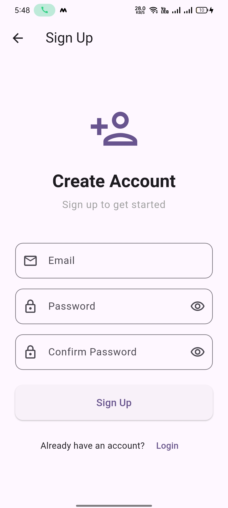
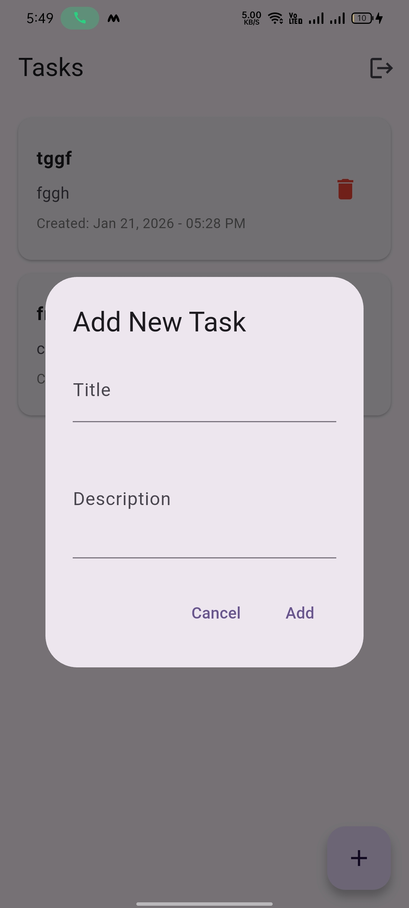

# Flutter Internship Assignment App

A comprehensive Flutter application demonstrating Firebase Authentication, Firestore Database, and REST API integration.

## Features

### Part 1: Firebase Authentication
- **Email & Password Login** - Secure user authentication
- **Signup Screen** - New user registration
- **Form Validation** - Email format and password length validation
- **Logout Functionality** - Secure user logout
- **Persistent Login State** - Auto-login on app restart using SharedPreferences

### Part 2: Firestore Database
- **Add Task** - Create tasks with title, description, and automatic timestamp
- **Real-time Task List** - Live updates from Firestore
- **Delete Task** - Remove tasks with confirmation dialog
- **User-specific Tasks** - Each user has their own task collection

### Part 3: API Integration
- **REST API Integration** - Fetches users from JSONPlaceholder API
- **ListView Display** - Clean and organized user list
- **Loading Indicator** - Shows progress while fetching data
- **Pull to Refresh** - Reload data on demand
- **Detailed User View** - Expandable cards with complete user information

## Screenshots

### Authentication Screens



### Main Features



## Setup Instructions

### Prerequisites
- Flutter SDK (3.0.0 or higher)
- Dart SDK
- Android Studio / VS Code
- Firebase account
- Android/iOS device or emulator

### Step 1: Clone the Repository
```bash
git clone <repository-url>
cd flutter_internship_app
```

### Step 2: Install Dependencies
```bash
flutter pub get
```

### Step 3: Firebase Setup

#### 3.1 Create Firebase Project
1. Go to [Firebase Console](https://console.firebase.google.com/)
2. Click "Add Project"
3. Enter project name and follow setup wizard

#### 3.2 Add Android App
1. In Firebase Console, click "Add app" → Select Android
2. Enter package name: `com.example.flutter_internship_app`
3. Download `google-services.json`
4. Place it in `android/app/` directory

#### 3.3 Add iOS App (Optional)
1. In Firebase Console, click "Add app" → Select iOS
2. Enter bundle ID: `com.example.flutterInternshipApp`
3. Download `GoogleService-Info.plist`
4. Place it in `ios/Runner/` directory

#### 3.4 Enable Firebase Authentication
1. Go to Firebase Console → Authentication
2. Click "Get Started"
3. Enable "Email/Password" sign-in method

#### 3.5 Create Firestore Database
1. Go to Firebase Console → Firestore Database
2. Click "Create Database"
3. Start in **Test Mode** (for development)
4. Choose a location and click "Enable"

#### 3.6 Configure Firebase in Flutter
Install FlutterFire CLI:
```bash
dart pub global activate flutterfire_cli
```

Configure Firebase:
```bash
flutterfire configure
```

This will automatically generate `lib/firebase_options.dart` with your Firebase configuration.

**OR** manually update `lib/firebase_options.dart` with your Firebase credentials.

### Step 4: Configure Android

Edit `android/build.gradle`:
```gradle
buildscript {
    dependencies {
        classpath 'com.google.gms:google-services:4.4.0'
    }
}
```

Edit `android/app/build.gradle`:
```gradle
plugins {
    id 'com.google.gms.google-services'
}

android {
    compileSdkVersion 34

    defaultConfig {
        minSdkVersion 21
        targetSdkVersion 34
    }
}
```

### Step 5: Run the Application

```bash
# Check connected devices
flutter devices

# Run on connected device
flutter run

# Build APK
flutter build apk --release
```

The release APK will be available at: `build/app/outputs/flutter-apk/app-release.apk`

## Project Structure

```
lib/
├── main.dart                          # App entry point
├── firebase_options.dart              # Firebase configuration
├── models/
│   ├── task_model.dart               # Task data model
│   └── user_model.dart               # User data model (API)
├── services/
│   ├── auth_service.dart             # Authentication logic
│   ├── firestore_service.dart        # Firestore operations
│   └── api_service.dart              # API integration
└── screens/
    ├── auth/
    │   ├── login_screen.dart         # Login UI
    │   └── signup_screen.dart        # Signup UI
    └── home/
        ├── home_screen.dart          # Main screen with tabs
        ├── tasks_tab.dart            # Tasks list & management
        └── users_tab.dart            # API users display
```

## Dependencies

```yaml
dependencies:
  firebase_core: ^2.24.2        # Firebase core SDK
  firebase_auth: ^4.15.3        # Authentication
  cloud_firestore: ^4.13.6      # Firestore database
  provider: ^6.1.1              # State management
  shared_preferences: ^2.2.2    # Local storage
  http: ^1.1.2                  # HTTP client
  intl: ^0.18.1                 # Date formatting
```

## Usage Guide

### Authentication
1. Launch the app
2. **New Users**: Click "Sign Up" → Enter email & password → Submit
3. **Existing Users**: Enter credentials → Click "Login"
4. App will remember your login state

### Tasks Management
1. Navigate to "Tasks" tab
2. Click "+" button to add a new task
3. Enter title and description → Click "Add"
4. Tasks update in real-time
5. Click delete icon to remove a task

### API Users
1. Navigate to "Users" tab
2. View list of users from API
3. Tap any user card to expand and view details
4. Pull down to refresh data

### Logout
1. Click logout icon in app bar
2. Confirm logout in dialog
3. Returns to login screen

## API Used

**JSONPlaceholder** - Free fake REST API for testing
- Endpoint: `https://jsonplaceholder.typicode.com/users`
- Method: GET
- Returns: List of 10 users with detailed information

## Firestore Structure

```
users/
  └── {userId}/
      └── tasks/
          └── {taskId}/
              ├── title: string
              ├── description: string
              └── createdDate: timestamp
```

## Form Validations

### Email Validation
- Required field
- Must match email format (regex: `^[\w-\.]+@([\w-]+\.)+[\w-]{2,4}$`)

### Password Validation
- Required field
- Minimum 6 characters

### Confirm Password
- Must match password field

## Build for Production

### Android APK
```bash
flutter build apk --release
```

### Android App Bundle (for Play Store)
```bash
flutter build appbundle --release
```

### iOS (requires Mac)
```bash
flutter build ios --release
```

## Troubleshooting

### Firebase Connection Issues
- Ensure `google-services.json` is in the correct location
- Verify package name matches Firebase configuration
- Run `flutter clean` and rebuild

### Gradle Build Errors
- Update Android Gradle Plugin to latest version
- Sync Gradle files in Android Studio

### Firestore Permission Denied
- Check Firestore rules in Firebase Console
- For development, use test mode rules:
```javascript
rules_version = '2';
service cloud.firestore {
  match /databases/{database}/documents {
    match /{document=**} {
      allow read, write: if request.auth != null;
    }
  }
}
```

## Technologies Used

- **Flutter** - UI framework
- **Firebase Authentication** - User authentication
- **Cloud Firestore** - NoSQL database
- **Provider** - State management
- **SharedPreferences** - Local storage
- **HTTP** - REST API calls

## Developer

Developed as part of Flutter Internship Technical Assignment

## License

This project is created for educational purposes as part of a technical assignment.

---

**Note**: Remember to configure Firebase properly before running the app. The app will not work without proper Firebase setup.

For any issues or questions, please refer to the troubleshooting section or check the official Flutter and Firebase documentation.
